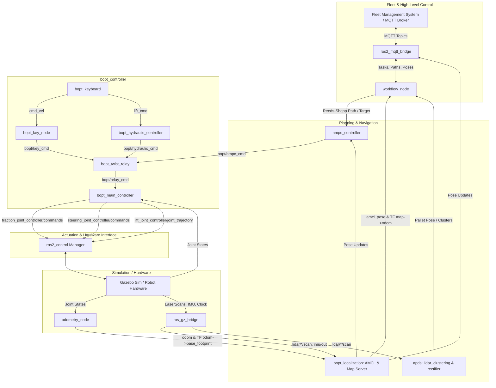

# BOPT Autonomous Mobile Robot (AMR) Workspace

Welcome to the **BOPT (Battery Operated Pallet Truck)** ROS 2 workspace. This repository provides a complete software stack for an autonomous, rear-steered reverse-tricycle pallet truck, including simulation in Gazebo Sim, modular kinematic and hydraulic control, odometry estimation, AMCL localization, SLAM mapping, NMPC path tracking, Automated Pallet Detection (APDS), mission workflow management, and Fleet Management System (FMS) connectivity via MQTT.

---

## 🎯 Objective
To develop a fully autonomous, robust, and scalable navigation and fleet management stack for the Battery Operated Pallet Truck (BOPT). The system aims to automate material handling in industrial environments by accurately localizing the robot, executing complex pick-and-drop pallet workflows via Reeds-Shepp path tracking and NMPC, reliably detecting pallets via lidar sensors, and integrating seamlessly with external Fleet Management Systems (FMS) over MQTT.

## 📈 Current Progress & Achievements
- **Simulation & Control**: Built an end-to-end simulation in Gazebo with an accurate reverse-tricycle drive and hydraulic forklift model. Implemented a robust modular controller stack (`bopt_controller`) for seamless transition between manual teleop and autonomous execution.
- **Mapping & Localization**: Successfully implemented online SLAM using `slam_toolbox` and AMCL-based 2D localization. Fused Odometry, IMU (`wit_ros2_imu`), and LiDAR data via `robot_localization` (EKF) for high-accuracy pose estimation. Added pose correction mechanisms (`byd_pose_correction_node_cpp`).
- **Autonomous Navigation & Workflow**: Developed an NMPC (Nonlinear Model Predictive Control) controller for precise trajectory tracking. Implemented a full mission orchestrator (`workflow_node`) capable of generating Reeds-Shepp paths, reading maps/graphs from a SQLite database, and managing pick-drop routines (`run_pick_drop_cycle.sh`).
- **Perception**: Integrated an Automated Pallet Detection System (APDS) with dual LiDAR clustering (`lidar_clustering`, `forktip_lidar_detection`) to accurately detect pallet poses for alignment. Added hardware IMU drivers (`wit_ros2_imu`) to improve real-world localization and heading estimation.
- **System Integration**: Setup MQTT bridging (`ros2_mqtt_bridge`) for live telemetry and remote task requests. Implemented robust TF trees and joint state publishing.

## 🏆 Results & Outcomes
- **Precision Tracking**: The NMPC controller ensures sub-centimeter accuracy when aligning the rear forks to the pallet.
- **Reliable Workflows**: The robot successfully executes autonomous pick and drop cycles, seamlessly tracking and picking pallets based on task requests.
- **Robust Localization**: IMU integration coupled with LiDAR/AMCL yields stable state estimation even in dynamic industrial conditions without wheel slip issues.
- **Scalability**: The modular ros2_control architecture allows effortless deployment between Gazebo simulation and the actual physical hardware.

---

## 📑 Table of Contents
1. [Objective](#-objective)
2. [Current Progress & Achievements](#-current-progress--achievements)
3. [Results & Outcomes](#-results--outcomes)
4. [System Architecture](#-system-architecture)
5. [Packages Overview](#-packages-overview)
6. [Prerequisites & Dependencies](#-prerequisites--dependencies)
7. [Building the Workspace](#-building-the-workspace)
8. [Quick Start & Launch Instructions](#-quick-start--launch-instructions)
   - [Full Simulation (Gazebo + RViz + Navigation)](#1-full-simulation-gazebo--rviz--navigation)
   - [Multi-Robot Simulation](#2-multi-robot-simulation)
   - [SLAM / Mapping Mode](#3-slam--mapping-mode)
   - [Standalone Localization](#4-standalone-localization)
   - [Mission Workflow & Fleet Management](#5-mission-workflow--fleet-management)
   - [Pallet Detection (APDS)](#6-pallet-detection-apds)
9. [Keyboard Teleoperation (bopt_keyboard)](#-keyboard-teleoperation-bopt_keyboard)
10. [ROS 2 Topics & Interface Map](#-ros-2-topics--interface-map)
11. [Configuration & Environment Variables](#-configuration--environment-variables)
12. [Troubleshooting](#-troubleshooting)

---

## 🏗 System Architecture

The following diagram illustrates how the modular packages, nodes, controllers, simulation, and external systems interact:



---

## 📦 Packages Overview

The workspace is organized into modular ROS 2 packages inside `src/`:

| Package | Type | Description |
| :--- | :--- | :--- |
| **`bopt_description`** | CMake | URDF/Xacro models, meshes, collision geometries, Gazebo worlds (`empty.world`), ros2_control hardware configurations, and multi-robot launch setups. |
| **`bopt_interfaces`** | CMake/ROS IDL | Custom ROS 2 message and service definitions (`BoptCommand`, `BoptCommandStamped`, `SetLiftHeight`). |
| **`bopt_controller`** | Python | Modular control stack for reverse-tricycle drive and hydraulics (`bopt_key_node`, `bopt_hydraulic_controller`, `bopt_twist_relay`, `bopt_main_controller`), odometry estimation (`odometry_node`), and teleoperation (`teleop_keyboard`). |
| **`bopt_localization`** | Python | Nav2 AMCL and Map Server lifecycle management for 2D map-based localization. |
| **`bopt_localization_test`** | Python | Test utilities and launch scripts for validating localization and odometry parameters. |
| **`bopt_mapping`** | Python | Online 2D SLAM utilizing `slam_toolbox` (async mode) and sensor fusion via `robot_localization` EKF. |
| **`byd_pose_correction_node_cpp`** | C++ | C++ implementation for correcting estimated poses and drift handling. |
| **`current_pose_fetch`** | Python | Utility node to sample and verify `/current_pose` topics with configurable QoS profiles. |
| **`forktip_lidar_detection`** | Python | Specific detection nodes using forktip LiDAR for high-precision pallet engagement. |
| **`load_transporter_node`** | Python | Logic for transporter mechanisms and load-handling state management. |
| **`nmpc_controller`** | Python | Nonlinear Model Predictive Control path tracking nodes with lookup table acceleration for smooth pallet pickup, drop, and parking. |
| **`ppts`** | Python | Path Planning and Tracking System modules and utilities. |
| **`ros2_mqtt_bridge`** | Python | Bi-directional bridge connecting ROS 2 topics with MQTT for remote fleet coordination and telemetry. |
| **`safety_demo`** | Python | Demonstration of safety stop protocols based on sensor fusion (LiDAR/obstacle detection). |
| **`wit_ros2_imu`** | CMake/Python | Driver and ROS 2 launch integration for the WIT standard IMU to provide robust heading and acceleration data. |
| **`workflow_node`** | Python | Mission orchestrator, SQLite database integration, graph waypoint traversal, Reeds-Shepp (RS) trajectory generation, and state machine. |
| **`apds`** | Meta/Python | **Automated Pallet Detection System**: includes `lidar_rectifier` and `lidar_clustering` for detecting and estimating pallet orientations from 2D LiDAR scans. |

---

## ⚙️ Prerequisites & Dependencies

### ROS 2 & System Tools
- **ROS 2**: Humble, Iron, or Rolling
- **Gazebo Sim**: `ros-gz` / `gz-sim` (Ignition Gazebo / Gazebo Fortress/Garden)
- **Nav2**: `ros-<distro>-nav2-bringup`, `ros-<distro>-nav2-amcl`, `ros-<distro>-nav2-map-server`
- **SLAM Toolbox**: `ros-<distro>-slam-toolbox`
- **Robot Localization**: `ros-<distro>-robot-localization`
- **ros2_control**: `ros-<distro>-ros2-control`, `ros-<distro>-ros2-controllers`, `ros-<distro>-joint-state-broadcaster`

Install standard ROS 2 dependencies:
```bash
sudo apt update
sudo apt install -y \
  ros-$ROS_DISTRO-ros-gz \
  ros-$ROS_DISTRO-nav2-bringup \
  ros-$ROS_DISTRO-slam-toolbox \
  ros-$ROS_DISTRO-robot-localization \
  ros-$ROS_DISTRO-ros2-control \
  ros-$ROS_DISTRO-ros2-controllers \
  ros-$ROS_DISTRO-joint-state-broadcaster \
  ros-$ROS_DISTRO-joint-trajectory-controller \
  ros-$ROS_DISTRO-position-controllers \
  ros-$ROS_DISTRO-forward-command-controller
```

### Python Dependencies
```bash
pip3 install paho-mqtt scipy numpy networkx psutil matplotlib pandas python-can rsplan
```

---

## 🔨 Building the Workspace

From the root workspace directory (`bopt_ws`):

```bash
# Source ROS 2 environment
source /opt/ros/$ROS_DISTRO/setup.bash

# Build all packages with symlink install
colcon build --symlink-install

# Source the workspace overlay
source install/setup.bash
```

> [!TIP]
> To rebuild a specific package quickly during development:
> ```bash
> colcon build --symlink-install --packages-select bopt_controller
> ```

---

## 🚀 Quick Start & Launch Instructions

### 1. Full Simulation (Gazebo + RViz + Navigation)
Launches the Gazebo world, spawns the BOPT robot, brings up the modular `bopt_controller` pipeline and `ros2_control` joint controllers, starts odometry, initializes AMCL localization with the default map, and opens RViz2:

```bash
# In Terminal 1:
source install/setup.bash
ros2 launch bopt_description simulation.launch.py
```

To run Gazebo in **headless mode** (saves GPU/CPU resources):
```bash
ros2 launch bopt_description simulation.launch.py gui:=false
```

---

### 2. Multi-Robot Simulation
To spawn and simulate multiple BOPT robots simultaneously (e.g., `robot001`, `robot002` with namespaced AMCL, MQTT, and modular controllers):

```bash
source install/setup.bash
ros2 launch bopt_description multi_robot.launch.py
```

---

### 3. SLAM / Mapping Mode
To build a new 2D grid map using SLAM Toolbox and the EKF filter:

```bash
# 1. Start simulation without default AMCL localization
ros2 launch bopt_description gazebo.launch.py

# 2. In a second terminal, start SLAM:
ros2 launch bopt_mapping mapping.launch.py

# 3. Drive the robot around using keyboard teleop to map the environment
ros2 run bopt_controller bopt_keyboard
```

---

### 4. Standalone Localization
If you already have a running simulation or real hardware and need to launch map server + AMCL:

```bash
ros2 launch bopt_localization localization.launch.py map_name:=bopt_map
```

---

### 5. Mission Workflow & Fleet Management

#### Launch MQTT Bridge (Connects robot to FMS):
```bash
ros2 launch ros2_mqtt_bridge mqtt_bridge.launch.py
```
*(Configure broker IP and topics in `src/ros2_mqtt_bridge/config/properties.yaml`)*

#### Run Mission Workflow Node:
```bash
ros2 run workflow_node workflow_node
```

#### Run NMPC Controller:
```bash
ros2 run nmpc_controller nmpc_controller_v2
```

---

### 6. Pallet Detection (APDS)
To launch the twin LiDAR clustering pipeline for automated pallet detection:

```bash
ros2 launch lidar_clustering lidar_clustering_launch.py
```

---

## 🎮 Keyboard Teleoperation (`bopt_keyboard`)

The `bopt_controller` package includes an interactive keyboard teleoperation node tailored for the BOPT reverse-tricycle drive and fork lift mechanism.

### How to Run:
```bash
# Open a new terminal and run:
source install/setup.bash
ros2 run bopt_controller bopt_keyboard
```

### Controls Layout:

```
-----------------------------------------------------------------------
                    BOPT Keyboard Teleoperation
-----------------------------------------------------------------------
Drive & Steer (WASD / Keypad / Arrow Keys):
      U    I    O                W
      J    K    L       or     A S D     or    [Arrow Keys]
      M    ,    .

  I / W / Up       : Forward (drive forward)
  , / S / Down     : Backward (drive in reverse)
  J / A / Left     : Steer Left  (+ angle)
  L / D / Right    : Steer Right (- angle)
  U                : Forward-Left
  O                : Forward-Right
  M                : Backward-Left
  .                : Backward-Right

Lift Mechanism:
  Q                : Raise Lift (forks up)
  E                : Lower Lift (forks down)

Safety & Reset:
  Space / K        : Stop Drive (Zero velocity & steering)
  R                : Reset All (Zero speed, steering & lift)
  CTRL-C           : Quit
-----------------------------------------------------------------------
```

---

## 🔌 ROS 2 Topics & Interface Map

### Controller Pipeline (`bopt_controller`)
| Topic / Service | Type | Description |
| :--- | :--- | :--- |
| `cmd_vel` | `geometry_msgs/msg/Twist` | Raw teleoperation velocity & steering command |
| `lift_cmd` | `std_msgs/msg/Float64` | Target fork lift height in meters (`0.0` to `0.095 m`) |
| `set_lift_height` | `bopt_interfaces/srv/SetLiftHeight` | Service interface to command lift height |
| `bopt/key_cmd` | `bopt_interfaces/msg/BoptCommandStamped` | Teleop command converted to vehicle kinematics |
| `bopt/nmpc_cmd` | `bopt_interfaces/msg/BoptCommand` | Autonomous path tracking commands from NMPC |
| `bopt/hydraulic_cmd` | `bopt_interfaces/msg/BoptCommand` | Validated hydraulic lift commands |
| `bopt/relay_cmd` | `bopt_interfaces/msg/BoptCommandStamped` | Aggregated / multiplexed command sent to main controller |
| `traction_joint_controller/commands` | `std_msgs/msg/Float64MultiArray` | Drive wheel angular velocity command to Gazebo/hardware |
| `steering_joint_controller/commands` | `std_msgs/msg/Float64MultiArray` | Steering assembly position angle command |
| `lift_joint_controller/joint_trajectory` | `trajectory_msgs/msg/JointTrajectory` | Trajectory command sent to lift controller |

### Odometry, State & Localization
| Topic Name | Type | Description |
| :--- | :--- | :--- |
| `joint_states` | `sensor_msgs/msg/JointState` | Measured position and velocity of joints |
| `odom` | `nav_msgs/msg/Odometry` | Computed vehicle odometry from reverse tricycle kinematics |
| `amcl_pose` | `geometry_msgs/msg/PoseWithCovarianceStamped` | Robot pose estimated by AMCL |
| `current_pose` | `geometry_msgs/msg/PoseStamped` | Current robot pose stream used by workflow & FMS |
| `map` | `nav_msgs/msg/OccupancyGrid` | 2D occupancy grid map from Map Server / SLAM |

### Sensors (Gazebo Bridge)
| Topic Name | Type | Description |
| :--- | :--- | :--- |
| `lidar/top3dl/scan` | `sensor_msgs/msg/LaserScan` | Primary 2D LiDAR scan used for localization |
| `lidar/front/scan` | `sensor_msgs/msg/LaserScan` | Front obstacle / safety scan |
| `lidar/back/scan` | `sensor_msgs/msg/LaserScan` | Rear safety scan |
| `lidar/left/scan`, `lidar/right/scan` | `sensor_msgs/msg/LaserScan` | Side detection scans |
| `imu/out` | `sensor_msgs/msg/Imu` | IMU orientation and angular velocity |

### Fleet / MQTT & Workflow
| Topic Name | Type | Description |
| :--- | :--- | :--- |
| `path` / `<robot_id>/path` | `std_msgs/msg/String` | Mission path waypoints from/to FMS |
| `task_request` | `std_msgs/msg/String` | Assigned mission task |
| `current_pose` | `geometry_msgs/msg/PoseStamped` | Real-time pose telemetry to FMS |
| `mqtt/status` | `std_msgs/msg/String` | Connection status to external MQTT broker |

---

## 🔧 Configuration & Environment Variables

Key parameters can be customized via config files and environment variables:

### Environment Variables
Export these in your shell or `~/.bashrc` as required by your setup:
```bash
export ROBOT_ID="robot001"
export ROBOT_IP="192.168.68.95"
export MQTT_BROKER="127.0.0.1"
export WS_PATH="/home/jkw/bopt_ws"
export DATABASE_PATH_VEH="/home/jkw/bopt_ws/src/workflow_node/map_details/vivek_demo_wn.db"
```

### Config Files
- **ros2_control**: `src/bopt_description/config/controller.yaml`
- **AMCL Localization**: `src/bopt_localization/config/amcl.yaml`
- **SLAM Toolbox**: `src/bopt_mapping/config/slam_toolbox.yaml`
- **EKF Fusion**: `src/bopt_mapping/config/ekf.yaml`
- **MQTT Bridge**: `src/ros2_mqtt_bridge/config/properties.yaml`
- **Workflow & Maps**: `src/workflow_node/map_details/`

---

## ❓ Troubleshooting

1. **Gazebo models not loading or meshes missing?**
   Make sure `GZ_SIM_RESOURCE_PATH` includes the description models path:
   ```bash
   export GZ_SIM_RESOURCE_PATH=$GZ_SIM_RESOURCE_PATH:/home/jkw/bopt_ws/src/bopt_description/models
   ```

2. **Controllers failing to spawn in Gazebo?**
   Ensure `joint_state_broadcaster` and the controller managers start after the simulation clock is active. If needed, restart `simulation.launch.py`.

3. **Robot not responding to keyboard commands?**
   - Verify nodes are running: `ros2 node list` should show `bopt_key_node`, `bopt_twist_relay`, `bopt_main_controller`, and `bopt_hydraulic_controller`.
   - Ensure the terminal running `bopt_keyboard` is focused when pressing keys.
   - Check the relay topic: `ros2 topic echo /bopt/relay_cmd`.

4. **MQTT Bridge connection errors?**
   Verify the MQTT broker is running locally or on the target network:
   ```bash
   sudo systemctl status mosquitto
   # Or test with mosquitto_pub / mosquitto_sub
   ```

---

## 👥 Contributors & Maintenance
- **Platform**: BOPT Autonomous Pallet Truck
- **Workspace Maintainers**: Vinay & Robotics Engineering Team
